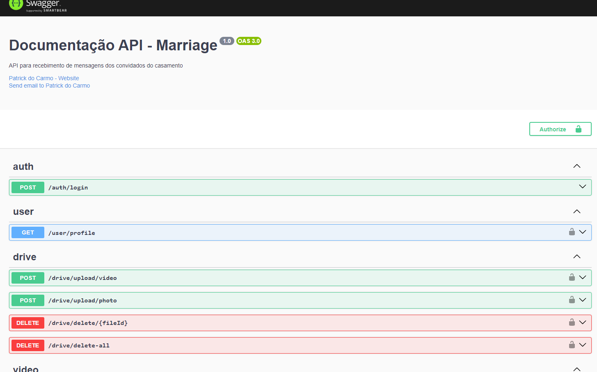

# Marriage

Um PWA que permitiu aos convidados de um casamento gravar mensagens em vídeo, fotos ou textos, para que o casal pudesse visualizá-las após a cerimônia.

## Principais Tecnologias Utilizadas
- [TypeScript](https://www.typescriptlang.org/)
- [Ionic](https://ionicframework.com/)
- [Angular](https://angular.dev/)
- [Node.js](https://nodejs.org/en)
- [Nest.js](https://nestjs.com/)
- [WebSocket](https://socket.io/)
- [Google Drive API](https://developers.google.com/drive/api/guides/about-sdk?hl=pt-br)
- [PostgreSQL](https://www.postgresql.org/)
- [TypeORM](https://docs.nestjs.com/recipes/sql-typeorm)

## Recursos / Funcionalidades

- **Autenticação com Google:** Obtenção do Google Id Token no front-end e envio para o back-end para obter o token JWT de acesso à API, além de cadastrar facilmente os usuários.
- **Upload de arquivos:** Upload utilizando a API do Google Drive para armazenamento das fotos e vídeos.
- **WebSocket:** Atualização em tempo real da barra de progresso do upload.
- **Controle de acesso:** Utilização de Role Guards no front-end e no back-end para controlar o acesso dos usuários a páginas restritas.
- **Painel administrativo:** Painel com controle total sobre mensagens, fotos e vídeos recebidos dos convidados.
- **Scroll infinito e refresh:** Garantindo maior fluidez ao visualizar as mensagens.
- **PWA:** Funciona tanto na web quanto no aplicativo mobile, consultando a mesma API.

## Links

- [Site](https://marriage-client-deploy.vercel.app/marriage/home)
- [APK (Aplicativo Android)](https://github.com/patrick-carmo/marriage/raw/main/client/marriage.apk)

## Documentação

Documentação da API Rest em Swagger presente no endpoint ``/api-doc``

  ```
  http://localhost:3000/api-doc
  ```

